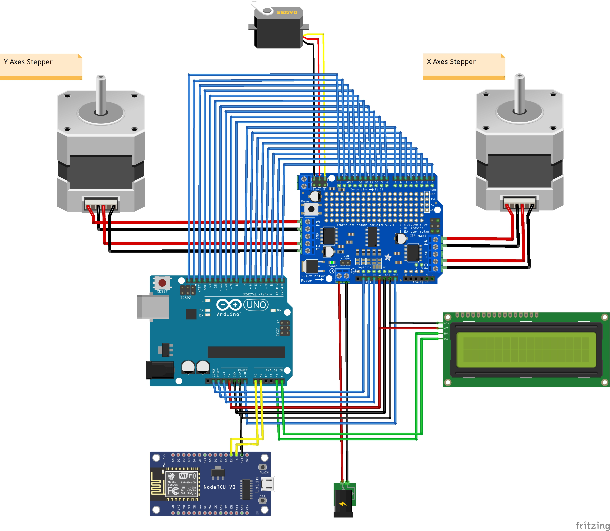
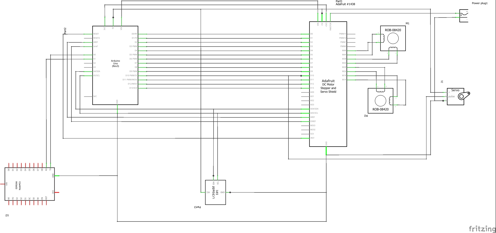
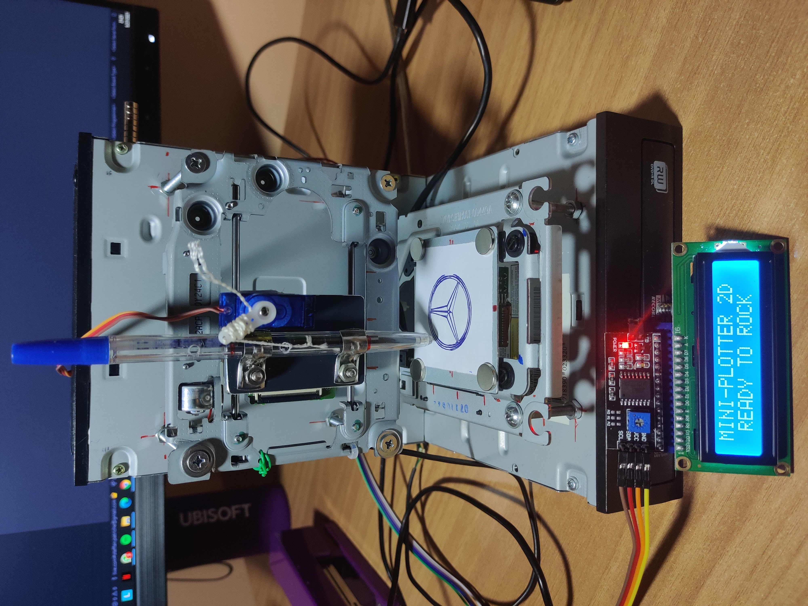
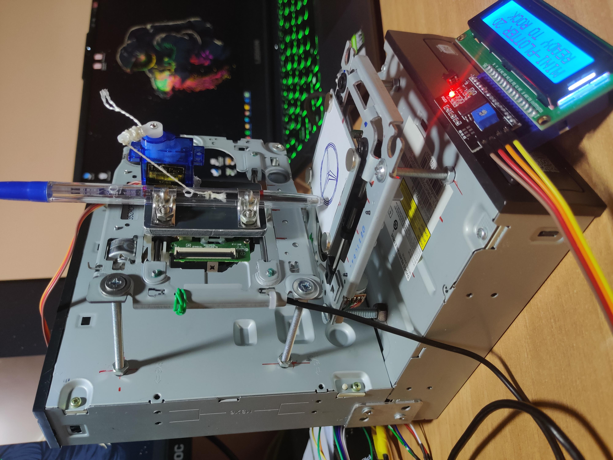
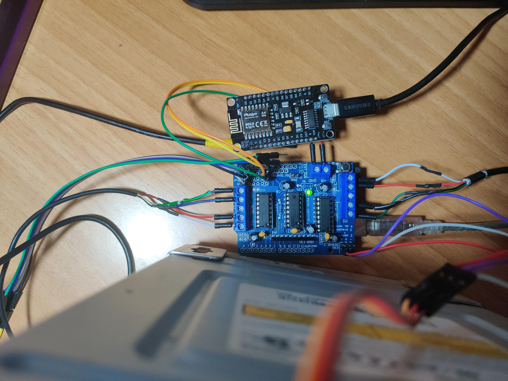
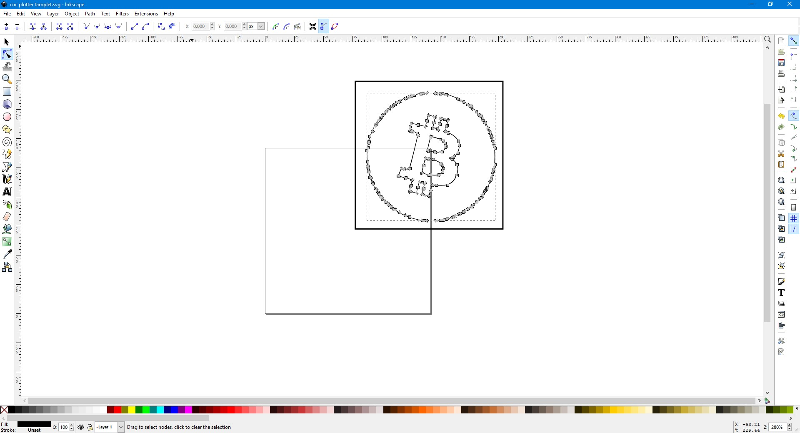
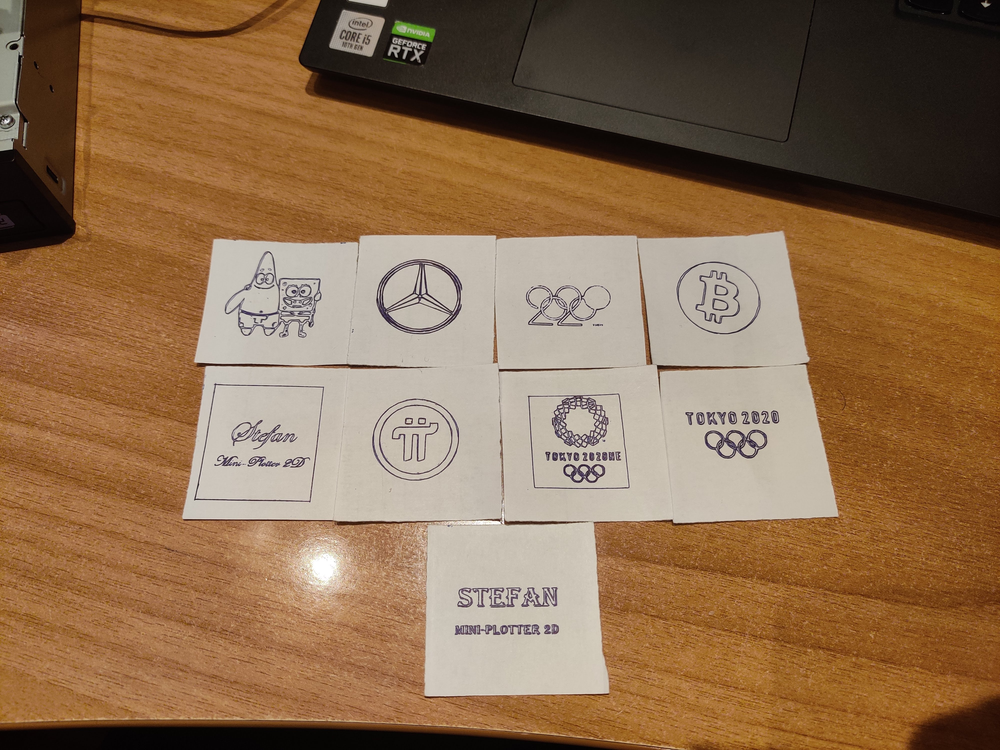

# Mini plotter 2D

## Componente necesare:

- 2 motoare pas cu pas din unitati optice reciclate
- 1 motor servo SG90
- Placuta de dezvoltate Arduino UNO
- Shield pentru control motoare L293D
- Modul wifi NodeMCU
- Modul LCD alfanumeric monocrom (cu conexiune I2C)

## Descriere functionalitati:

- functionalitatea principala este cea de desenare(plotare) a unor poze/texte.
- functionalitati secundare:
    - conectarea unui ecran LCD monocrom prin intermediul protocolului I2C ce va afisa un mesaj cand plotarea este gata sau o mica animatie care indica nivelul de finalizarea al procesului
    - un mod de utilizarea manual realizata prin conectarea unui NodeMCU(Wifi module) la Arduino si prin aplicatia Blynk pe telefon, prin intermediul careia controlez msicarile mini plotter-ului

## Diagrama de conectare:

## Schema electrica:

## Modalitate de realizare:
- Pentru inceput, am desfacut cele 2 DVD Writere pentru a putea extrage motoarele pas cu pas din ele

- Dupa care am incercat si am scris un cod de test pentru a verifica functionalitatea motoarelor pas cu pas

- Pentru montajul fizic m-am folosit de carcasele de DVD Writere si am adaugat ecranul lcd monocrom care sa afiseze mesaje legate de procesul de plotare

- Am folosit si un modul wifi (NodeMCU) care se foloseste de protocolul de comunicatie UART pentru a comunica cu Arduino si a transmite comenzi suplimentare pentru utilizarea manuala

## Mod de functionare:

### Modul de functionare automat:

- Am folosit programul Inkscape pentru a transforma orice poza sau text in cod GCODE pentru a putea fi interpretat de plotter.

- Am folosit un program care comunica cu Arduino pe baza portului serial prin care este conectat cu calculatorul, acesta citeste un fisier GCODE (care contine informatiile pentru a misca motoarele) si trimite linie cu linie comenzile catre Arduino care le interpreteaza si misca motoarele in functie de acestea

- Comenzile care sunt interpretate sunt urmatoarele
    - G1 pentru miscare (ex: G1 X60 Y30 | G1 X30 Y50)
    - G4 P300 (asteapta 150ms)
    - M300 S30 (da pixul in jos)
    - M300 S50 (da pixul in sus)
    - Elimina orice incepe cu  '('
    - Elimina oricare alta comanda

### Modul de functionare manual:

- Modulul NodeMCU l-am legat prin protocolul UART de placuta Arduino (shield-ul folosit pentru controlul motoarelor ocupa toti pinii digitali + RX si TX asa ca am fost nevoit sa imi creez alti pini pentru conexiunea seriala cu ajutorul unei librarii la pinii analogici A0 si A1)

- Cu ajutorul modulului si cu aplicatia Blynk instalata pe telefon am diferite moduri de a controla manual motoarele:
    - Fie cu ajutorul a 4 butoane care incrementeaza/decrementeaza motoarele cu 2mm pe apasare si un buton pentru ridicarea si coborarea pixului
    - Cu ajutorul a 2 slidere prin care pot sa pozitionez exact distanta la care sa fie ambele motoare si un buton care ridica si coboara pixul
    - Cu ajutorul unui joystick prin care pot sa mut capul de desenare pe cele 2 axe X si Y de control si un buton de ridicare si coborare al pixului
    
     

## Rezultat final:
 

## Link youtube: [Video de prezentare](https://youtu.be/GmLkTNzcbe0)