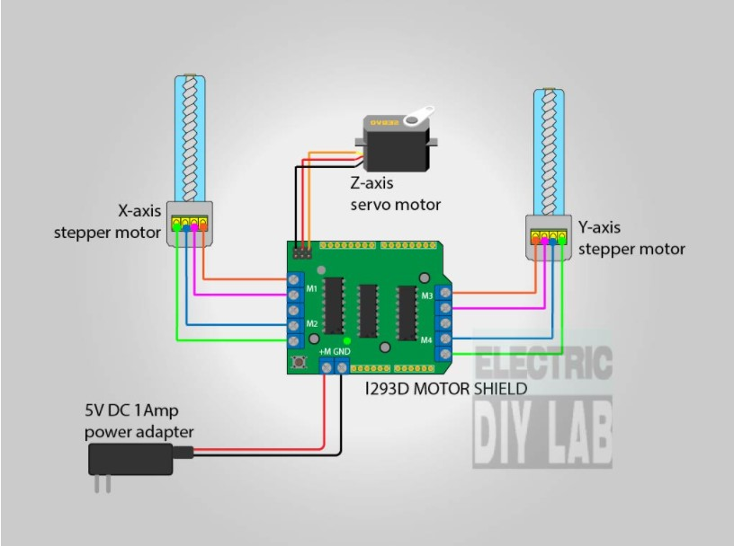

# Titlu proiect: Mini Plotter 2D

## Componente necesare:

- 2 motoare pas cu pas din unitati optice reciclate
- 1 motor servo SG90
- Placuta de dezvoltate Arduino UNO
- Shield pentru control motoare L293D
- Modul wifi NodeMCU
- Modul LCD alfanumeric monocrom (cu conexiune I2C)

## Descriere functionalitati:

- functionalitatea principala este cea de plotare a unor poze/texte.
- functionalitati secundare:
    - conectarea unui ecran LCD monocrom prin intermediul protocolului I2C si ce va afisa un mesaj cand plottarea este gata sau o mica animatie care indica nivelul de finalizarea al procesului
    - adaugarea unui led pentru pentru semnalizarea finaliarii sau care semnaleaza ca mini plotter-ul este in functiune
    - in functie de cati pini o sa mai am liberi as vrea sa incerc si sa conectez un modul wifi prin care sa pot da comezi de printare pentru diferite desene presetate

## Diagrama de conectare a motoarelor la shield:
